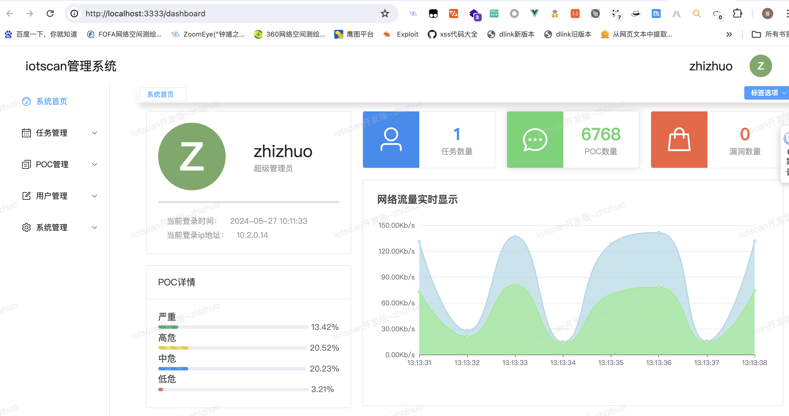
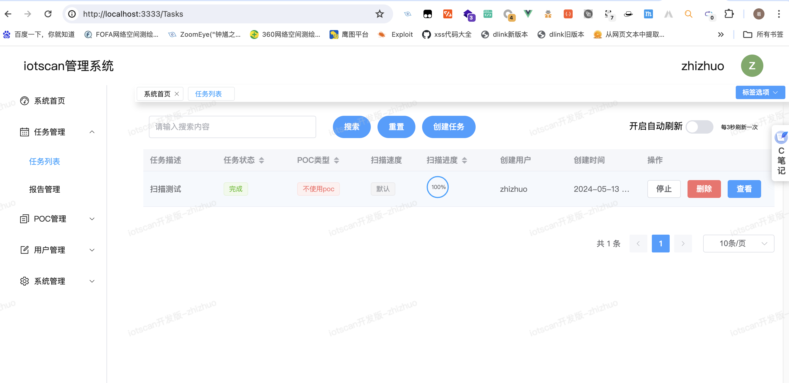
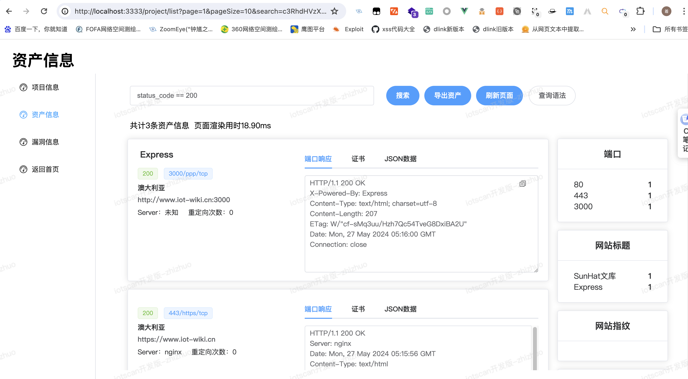
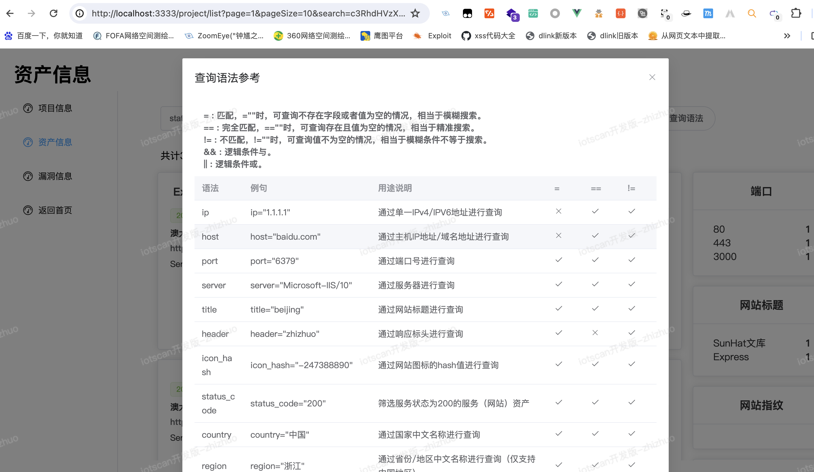
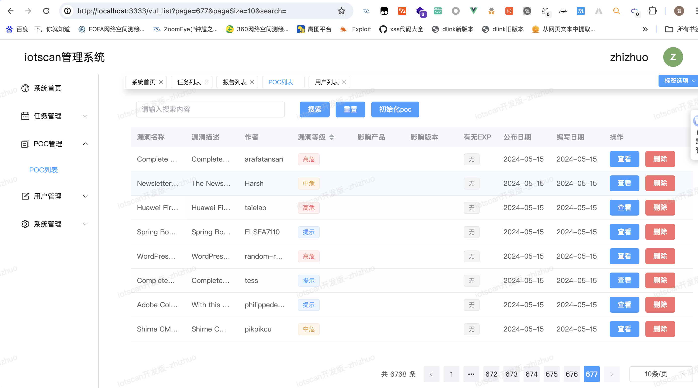
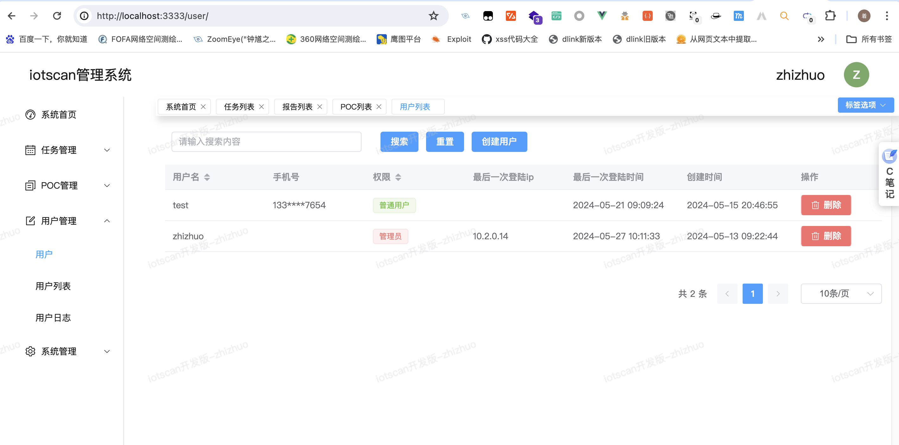

# iotscan-web

这是一个基于vue3+element-plus+vite4+pinia开发一个资产测绘平台+漏洞扫描的前端项目，提供多种自定义的开发，如果你的扫描器或资产测绘平台不追求UI仅仅是为了快速开发，可以参考此项目。

## Project Setup

```shell
npm install
```

### Compile and Hot-Reload for Development

```shell
npm run dev
```

### Type-Check, Compile and Minify for Production

```shell
npm run build
```

### Run Unit Tests with [Vitest](https://vitest.dev/)

```shell
npm run test:unit
```

### Lint with [ESLint](https://eslint.org/)

```shell
npm run lint
```

### Preview使用

```shell
# stage environment
pnpm preview:stage

# prod environment
pnpm preview:prod
```

## 界面展示













